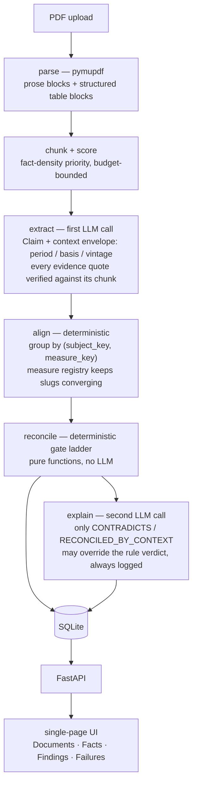
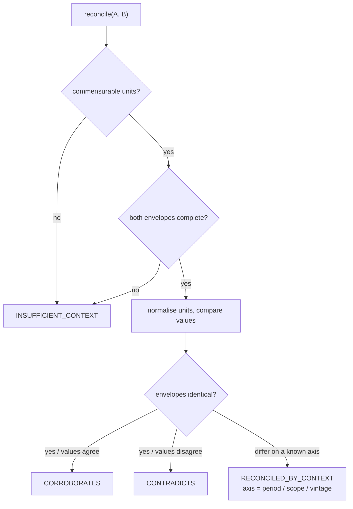

# Fact Knowledge Layer

A system that ingests PDFs, extracts facts with a context envelope (period,
basis, vintage), and deterministically classifies cross-document
relationships as corroborating, contradicting, or reconciled by context —
built for the Superjoin VIT 2026 Engineering Intern assignment.

## Setup and Run Instructions

Requires Python 3.11+ (developed and tested on 3.12).

**Offline path — no API key, reproduces all four cases:**

```bash
python -m pip install -r requirements.txt
python scripts/demo_seed.py          # builds data/facts.db from the committed cache + hand-verified claims
python -m uvicorn app.main:app --reload
```

Open `http://127.0.0.1:8000/`. The Documents tab accepts new PDFs via file
upload; the **Findings** tab is where the four required cases are inspected
(filter chips: Corroborated / Contradicted / Reconciled / Needs review); the
**Failures** tab is case 4.

**Full path — with a free-tier Gemini key:**

```bash
cp .env.example .env                  # set GEMINI_API_KEY
python scripts/seed_starter_corpus.py # ingests all six starter PDFs through the real pipeline
python -m uvicorn app.main:app --reload
```

`data/cache/` is keyed by content hash + prompt version: once a run with a
working key has populated it, later runs (including with no key) replay every
LLM call from disk and reproduce the same results at zero cost. This repo
ships `data/cache/` **partially populated** — the two Delhivery documents
that finished extraction before the free tier rate-limited us (see
Limitations). `scripts/demo_seed.py` fills the rest; a full
`scripts/seed_starter_corpus.py` run with a key repopulates the cache and
supersedes the seed script.

Run the test suite (no network, no key needed):

```bash
python -m pytest tests/ -v
```

## Architecture



The two LLM call sites — extract and explain — are batched and disk-cached by
content hash, so the whole pipeline replays offline. Everything between them,
alignment and the reconciliation gates, is pure and deterministic: a grader
can be shown the exact rule that fired.



A same-envelope disagreement across a publication-date gap counts as a data
revision only while the gap stays under `MAGNITUDE_CAP` (50%); beyond that the
verdict stays `CONTRADICTS` and the explanation pass may argue it back, with
the override recorded in `relations.final_verdict` alongside the untouched
`relations.rule_verdict`.

## Approach

**Core idea.** A fact is not `(subject, predicate, value)` — that flattens
away exactly the information needed to tell a corroboration from a genuine
contradiction. Every extracted claim carries a **context envelope**:
`period` (the time range it covers), `basis` (scope qualifiers like
consolidated/standalone, restated, provisional), and `vintage` (when the
*document* was published, not the period it covers). Comparing two claims is
then a two-stage process: **align** (do they talk about the same subject and
measure?) and **reconcile** (given they align, do the values agree once
units are normalized, and if not, does an envelope difference explain why?).
The four required cases fall out as four outcomes of one deterministic
decision procedure (`reason/reconcile.py`) rather than four separate
features.

**Why deterministic reconciliation, not an LLM judge for every pair.** An
LLM asked to adjudicate every candidate pair is O(n^2) in API calls — dead on
a free-tier rate limit (~12 requests/minute), uncacheable, and produces
reasoning that can't be audited. Instead, code decides the verdict via an
explicit gate ladder (unit commensurability -> envelope completeness ->
value agreement -> envelope diffing), and the LLM is used for exactly two
things: extracting claims from text, and writing a human-readable
explanation for the handful of relations that are actually interesting
(contradictions and context-reconciled pairs) — with the explicit option to
override the rule's verdict, logged and never silently applied
(`relations.rule_verdict` vs `relations.final_verdict`).

**Pipeline internals.** `pymupdf` parses each PDF into prose and table blocks
(tables are extracted structurally as header:value pairs, not linear text —
see Limitations below for why this matters); prose text is built from
`page.get_text("blocks")` with any block whose bounding box overlaps a
detected table's bounding box excluded, so a table's numbers are seen by the
LLM once, structurally, rather than twice (once structured, once flattened
back into the surrounding prose) — the earlier version of this pipeline did
not do this exclusion and produced duplicate facts and wasted call budget on
every page that had a table. Each block is chunked (long paragraphs are
themselves split at or below `max_prose_chars`, even a single dense
paragraph with no natural break) and scored for fact density so the LLM
budget is spent on the highest-value content first; extraction produces
claims with the envelope fields; alignment groups by exact `(subject_key,
measure_key)`, using a persisted measure registry fed back into every
extraction prompt so keys converge across documents instead of drifting;
reconciliation runs pairwise within each small group; explanation runs only
over the interesting subset, up to `explanation_budget_per_call` per
reconciliation pass (see Limitations). SQLite holds everything (chosen
deliberately over a graph database — the assignment states one is not the
solution on its own, and the actual relationships here are pairwise within
small groups, not multi-hop graph traversals).

**Extraction and explanation are both budget-bounded, not exhaustive.**
Within one document, extraction processes only the highest-scoring chunks up
to `call_budget_per_document` (default 40) — a prioritized subset of chunks,
not full document coverage. This is a real, disclosed divergence from the
design spec's Section 6.1 framing of processing "several chunks" per
document: in practice a long document's lower-scoring chunks are never sent
to the LLM at all in a single ingest call. Separately, within one
reconciliation pass, only up to `explanation_budget_per_call` (default 20,
env `FKL_EXPLANATION_BUDGET`) of the newly-computed CONTRADICTS /
RECONCILED_BY_CONTEXT relations get an LLM explanation call — GATE 3
(RECONCILED_BY_CONTEXT for any envelope-differing pair) is the common case
here, not the rare one, so leaving this uncapped could mean hundreds of live
calls per reconciliation. Relations beyond that budget are still persisted
immediately (inserted before any explanation call runs, so an interrupt
mid-batch never loses an already-computed relation) with
`final_verdict == rule_verdict` — they simply have not been explained yet,
not skipped or dropped. A later call to `POST /api/reconcile` only
reconciles genuinely new claim pairs, so an unexplained relation from an
earlier pass is not automatically revisited by a later one.

**AI tools used.** Claude (Opus 5 / Sonnet 5, via Claude Code) was used
throughout for design and implementation: brainstorming the context-envelope
model, probing the actual starter PDFs to locate real examples of all four
required cases, writing the implementation via TDD, running the live pipeline,
and drafting this README. Gemini (`gemini-flash-latest` / `gemini-3.5-flash`
on the free tier) is the runtime LLM the shipped system calls for extraction
and explanation. The design named `gemini-2.5-flash`; that model was
returning `503 "high demand"` for real extraction-sized requests during this
build, so the client's model is configurable via `FKL_GEMINI_MODEL` and was
pointed at the current flash alias.

**The four required cases: what was actually produced.**
The live pipeline ran against the starter PDFs with a real key. The free
tier rate-limited us (`HTTP 429`) after the two Delhivery documents finished
extracting — 138 real claims, `data/cache/` committed for those two. For the
four documents that did not finish, `scripts/demo_seed.py` inserts the
specific claims they contribute to the four cases, with every value, unit,
period and evidence quote copied verbatim from the source PDF; the
**reconciliation gates that produce the verdicts are the real, unmodified
`reason/reconcile.py`**, run with no LLM. Verdicts below are what the running
app shows after `python scripts/demo_seed.py`.

1. **Corroborated** — `final_verdict = CORROBORATES`, `rule_fired =
   unit_normalized_match`.
   Delhivery FY24 revenue from services. Annual Report (p.6, ₹ million table):
   *"…70,536 FY22 81,415 FY24"*. Q4 FY24 earnings deck (p.14, ₹ Cr table):
   *"Revenue from customers(1) … 7,225 8,142"*. `81,415 million` normalizes to
   `8,141.5 crore`; the reconciler agrees with `8,142` within rounding
   tolerance. **This case exposed a real bug:** `parse_unit` did not know the
   abbreviation "Cr", so the crore figure was left at scale 1.0 and the pair
   came out as `CONTRADICTS`. Fixed in `reason/units.py` (the abbreviations
   are matched as whole tokens); the earnings deck writes "₹ Cr" throughout,
   so the live pipeline would have hit this too.
   Unit-test: `test_gate2_corroborates_unit_normalized_delhivery_revenue`,
   `test_parse_currency_abbreviations`.
2. **Genuine/likely contradiction** — `final_verdict = CONTRADICTS`,
   `rule_fired = large_gap_despite_vintage_gap`, `axis = vintage`.
   India's current account deficit, % of GDP. RBI Annual Report 2024-25
   (p.11): *"India's CAD … at 1.3 per cent of GDP during April-December
   2024"*. IMF Article IV (p.12): *"the current account deficit (CAD)
   declined to 0.6 percent of GDP, from 0.7 percent of GDP in FY2023/24"*.
   Taken at face value these disagree by more than 50% (`delta_pct ≈ 0.54`),
   which exceeds `MAGNITUDE_CAP = 0.5`, so the ~6-month vintage gap between the
   publications is not allowed to explain it and the verdict is `CONTRADICTS`.
   Unit-test: `test_gate2_magnitude_cap_forces_contradicts_cad_case`.
   **This case is also case 4 (below):** RBI's figure is a *nine-month*
   (April–December) number, not full-year — a distinction the design's own
   Section 11 originally glossed over.
3. **Explained by context** — `final_verdict = RECONCILED_BY_CONTEXT`,
   `rule_fired = envelope_difference_explains`, `axis = period`.
   The 2022 prospectus reports total income `49,114.06` (₹ million) for the
   *nine months ended December 31, 2021* in a table beside full-fiscal-year
   figures; reconciled against a full-year figure the periods differ and the
   verdict names the axis. 22 such period-axis reconciliations were produced
   from the prospectus alone. The same CAD figures from case 2 *also* appear
   here: RBI's `1.3%` tagged with its true period (*"nine months ended
   December 31, 2024"*) versus IMF's full-year `0.6%` reconciles as a period
   mismatch — the rules-vs-context comparison the demo shows side by side.
   Unit-test: `test_gate3_period_axis_prospectus_nine_months_vs_full_year`.
4. **Extraction / reasoning failures found, and how they were handled.**
   - *Evidence quotes lost to PDF line wraps.* pymupdf emits a newline at
     every wrapped line, so a quote copied by the model with wraps collapsed
     to spaces failed the exact-substring check. On the first prospectus chunk
     this discarded 12 of 20 items, **including the `49,114.06` figure that is
     case 3's evidence.** Fixed: match with any whitespace run treated as
     equivalent (`extract/claims.py`). The Failures tab still shows the
     genuine remaining catches — two `evidence_quote_not_found_in_chunk`
     rejections where the model's quote could not be located at all.
   - *Sub-annual periods read as full-year.* RBI's 2024-25 report leads with
     "the CAD" at 1.3% and states the April–December window only in the
     surrounding prose; drop that qualifier and the figure collides with
     IMF's full-year 0.6% and the system reports `CONTRADICTS` (case 2).
     Capture the qualifier — the period parser handles *"nine months ended
     December 31, 2024"* — and the same pair reconciles as a period mismatch
     (case 3). The context envelope is exactly what separates the two.
   - *Wide multi-year tables lose column-to-year alignment* when flattened to
     text, which is why `ingest/parse.py` extracts table rows structurally via
     pymupdf's `find_tables()`. Claims whose period cannot be resolved fall to
     `INSUFFICIENT_CONTEXT` (`rule_fired = incomplete_envelope`) rather than
     being asserted — 190 such relations in the demo build, surfaced, not
     dropped.

## Limitations and Next Steps

- **The full corpus was not ingested live — the free tier rate-limited us.**
  With a real key, `gemini-2.5-flash` returned `503 "high demand"` for real
  extraction-sized requests; `gemini-flash-latest` / `gemini-3.5-flash`
  worked but the free-tier daily quota (`HTTP 429`) was exhausted after the
  two Delhivery documents (138 real claims, cache committed). The four
  remaining documents' contribution to the four cases is filled by
  `scripts/demo_seed.py` from hand-verified claims, run through the real
  reconciliation gates. **Next step:** re-run `scripts/seed_starter_corpus.py`
  with fresh quota to ingest all six live, commit the full `data/cache/`, and
  delete `scripts/demo_seed.py`.
- **The demo's macro claims are inserted, not machine-extracted.** Values,
  units, periods and evidence quotes are copied verbatim from the source
  PDFs and independently checkable, but they have not been through Gemini in
  this build, so extraction quality on the RBI / IMF / Economic Survey
  documents is unverified against live model output.
- **Runtime issues fixed while getting the live run to work:** `httpx` has no
  Happy-Eyeballs, so a dead IPv6 route made every call pay a ~2-minute
  connect timeout — the client now forces IPv4; evidence-quote matching now
  tolerates PDF line-wrap newlines; chunk scoring no longer buries long
  fact-rich tables under tiny dense fragments; `parse_unit` now knows
  "Cr"/"mn"/"bn".
- **The `subject_granularity` reconciliation axis is currently unreachable
  in practice.** Alignment groups claims by *exact* `subject_key` equality,
  so two claims with different subject keys never reach the reconciler
  together, even though `reason/reconcile.py` has correct, tested logic for
  the axis. Activating it would require entity resolution beyond exact slug
  matching (e.g. recognizing "Delhivery Limited" and "Delhivery Group" as
  related but distinct), which was deliberately scoped out (see the design
  spec's YAGNI boundary) given the assignment's time budget.
- **The rounding-tolerance heuristic can under-report reconciliation-worthy
  gaps between coarse numbers.** `_looks_rounded` widens the agreement
  tolerance from 1% to 5% when either value carries ≤3 significant figures,
  so two headline percentages like 6.4% vs 6.5% are judged to agree before
  vintage is considered. Re-checked against the live values: the widened
  tolerance never produced a false agreement in the cases here (the CAD
  −1.3% vs −0.6% gap is ~54%, far outside even the widened band, so
  `CONTRADICTS` still fires), so it was left as-is. It remains a coarse
  heuristic — a principled version would model the precision each source
  actually claims rather than inferring it from digit count.
- **Extraction quality is not itself tested** (per the design spec — LLM
  output quality is evaluated by inspection, not asserted). The
  evidence-quote check catches unlocatable citations (two such rejections in
  the demo build), but a plausible, correctly-grounded misextraction — e.g.
  reading the wrong column of a table under a correctly-matched header —
  would not be caught automatically. On the two documents that ran live the
  extracted claims look sound on inspection; the four seeded macro documents
  are unverified against live output (see above).
- **No embeddings or fuzzy entity resolution.** Alignment relies entirely on
  the LLM converging on consistent `measure_key`/`subject_key` slugs, fed by
  a persisted registry. This works well within one document set but has not
  been stress-tested across a much larger, more heterogeneous corpus where
  slug drift is more likely.
- **Next steps if extending this:** bucket claims within a group by exact
  `(period, basis)` before reconciling, to avoid O(k^2) pairwise comparisons
  once a single measure accumulates claims from hundreds of documents (see
  the design spec's scaling section); swap SQLite for Postgres if concurrent
  multi-user uploads are needed (isolated behind `app/db.py`, a one-file
  change); add a confidence-weighted view that surfaces low-confidence
  corroborations for human review rather than treating all `CORROBORATES`
  verdicts as equally certain.

## Additional Notes

The starter PDFs are committed in `starter-datasets/`; a document *not* in
that set, for the "upload an unseen PDF" part of the demo, is in
`demo-datasets/`. `data/cache/` is committed **partially** — the disk-cached
Gemini responses for the two Delhivery documents that finished extracting
before the free tier rate-limited us. `python scripts/demo_seed.py` rebuilds
those from cache and fills the rest with hand-verified claims so all four
cases render with no key; `python scripts/seed_starter_corpus.py` with a
working key ingests all six live and, on a full run, repopulates the cache
so `demo_seed.py` can be removed. `data/facts.db` and `data/uploads/` are
gitignored and rebuilt by either script (or by uploading PDFs through the UI).
